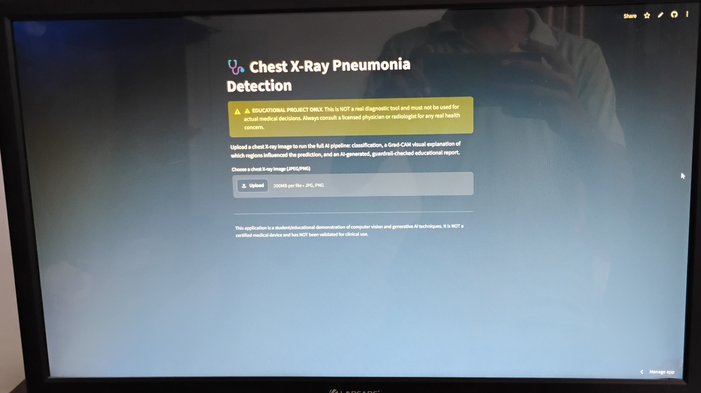
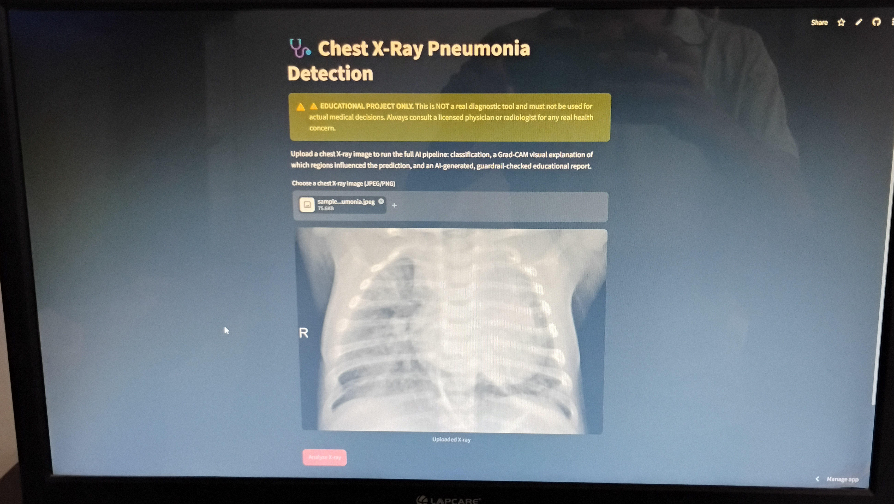
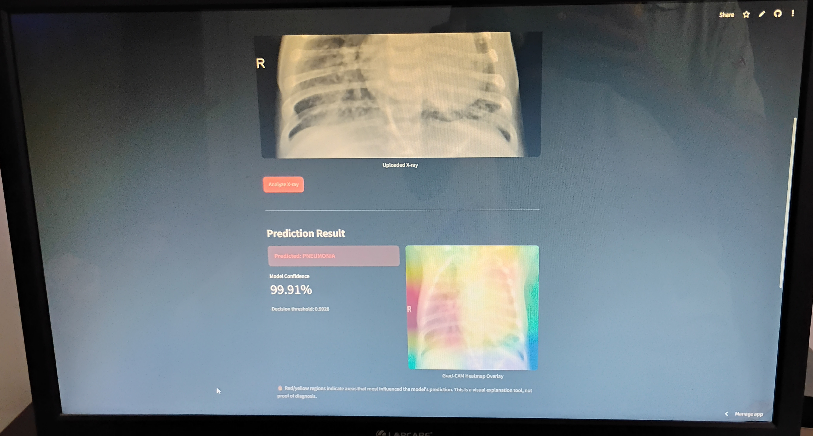
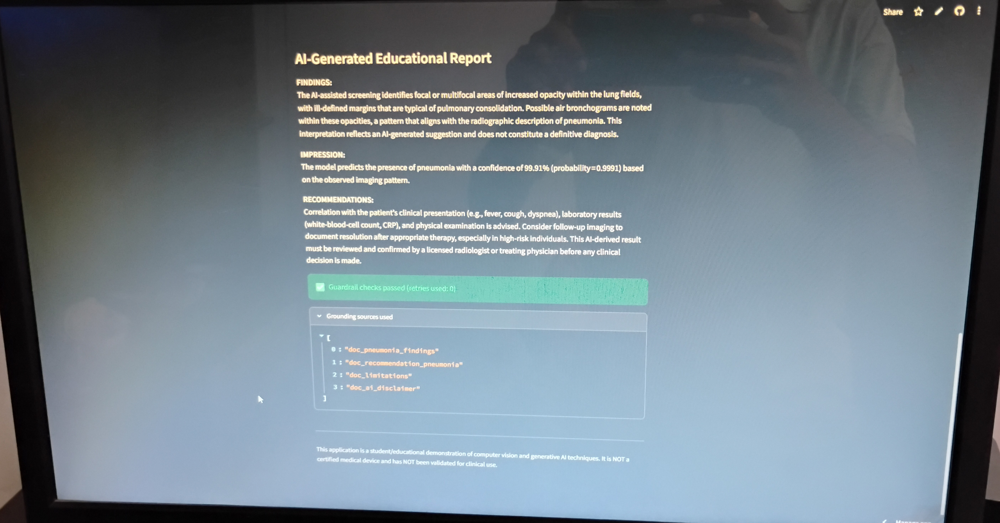

# 🩺 Image-Based-Disease-Detection-e.g.-Pneumonia-from-X---rays-
Agentic AI pipeline: CNN classification + Grad-CAM explainability + RAG-grounded reporting + automated safety checks

Detect medical conditions from radiology images.

⚠️ Disclaimer

This is an educational / portfolio project, not a medical device. It has not been clinically validated and must never be used for real diagnostic or treatment decisions. Every prediction and AI-generated report includes this same warning. Always consult a licensed physician or radiologist for real health concerns.

> ## 🌐 Live Demo

  

📸 Screenshots

|     Main - UI    |
|:----------------:|
|  |

| Upload & Analyze | 
|:----------------:|
|  | 

| Prediction + Grad-CAM |
|:---------------------:|
|  |

| AI Educational Report |
|:---------------------:|
|  |

✨ What This Project Does

 - Upload a chest X-ray and the system runs it through a 4-agent pipeline, orchestrated with LangGraph, in a single API call:

   - Classifier — a CNN (TensorFlow/Keras) predicts PNEUMONIA vs NORMAL with a tuned decision threshold.
    
   - Explainer — generates a Grad-CAM heatmap showing which regions of the X-ray most influenced the prediction.
     
   - Report Writer — an LLM (Groq, openai/gpt-oss-120b) writes a structured FINDINGS / IMPRESSION / RECOMMENDATIONS report, grounded only in a retrieved radiology knowledge base (RAG) — it is explicitly instructed not to       invent clinical facts.
     
   - Safety Checker — a rule-based guardrail validates the generated report (required sections present, no overconfident/definitive diagnostic language, disclaimer present, predicted label and confidence actually               mentioned, no grounding mismatch).
     
   - If it fails, the pipeline automatically loops back and retries report generation (up to a configurable limit) before returning a result either way.

   Upload X-ray
     │
     ▼
┌─────────────┐      ┌─────────────┐      ┌────────────────┐      ┌─────────────────┐
│  Classifier │ ──▶ │  Explainer  │ ──▶  │  Report Writer │ ──▶ │  Safety Checker │
│  (CNN)      │      │  (Grad-CAM) │      │  (RAG + Groq)  │      │  (guardrail)    │
└─────────────┘      └─────────────┘      └────────────────┘      └─────────┬────────┘
                                                ▲                           │
                                                └──── retry (≤2) ──────────┘ fail
                                                                           │ pass
                                                                           ▼
                                                                   Final JSON response
   
     

🧱 Tech Stack
     Layer	                  Technology
    ______________________________________________________
     Model	                  TensorFlow / Keras CNN, Grad-CAM explainability
     Agent orchestration	    LangGraph (stateful multi-agent graph with conditional retry edge)  
     Report generation	      LangChain + Groq (openai/gpt-oss-120b)
     Grounding	              Lightweight RAG over a radiology knowledge-base of reference findings/recommendations
     Backend                  API	FastAPI + Uvicorn
     Frontend	                Streamlit
     Containerization	        Docker + Docker Compose (separate API and UI containers)
     

## ✨ Features

- **Binary Classification** – NORMAL vs PNEUMONIA using a fine-tuned CNN (MobileNetV2-style backbone, `stage2_final` model)
- **Grad-CAM Visual Explanations** – Heatmap overlay highlighting the regions that most influenced the prediction
- **Multi-Agent Pipeline** (LangGraph)  
  1. **Classifier Agent** – Runs the CNN  
  2. **Explainer Agent** – Generates Grad-CAM  
  3. **Report Writer Agent** – Produces a structured educational report grounded in RAG  
  4. **Safety Checker Agent** – Applies guardrails and retries if needed
- **RAG-Grounded Reports** – Report generation uses retrieved medical context (no hallucinated clinical details)
- **FastAPI Backend** – Clean REST endpoints (`/predict`, `/report`, `/agentic-report`, `/health`)
- **Streamlit Frontend** – Simple, modern UI for uploading X-rays and viewing results
- **Docker-Ready** – One-command deployment with `docker-compose`
- **Safety First** – Multiple disclaimers + automatic guardrail checks on every generated report

🚀 Getting Started

  Option A — Docker (recommended)
  
  bash
  git clone https://github.com/yashraj022381/Image-Based-Disease-Detection-e.g.-Pneumonia-from-X---rays-.git
  cd Image-Based-Disease-Detection-e.g.-Pneumonia-from-X---rays-

  cp .env.example .env
  # edit .env and add your GROQ_API_KEY

  docker compose up --build
 
 > API: http://localhost:8000/docs
 > Web app: http://localhost:8501

  Option B — Manual (no Docker)
  
  bash
  python -m venv venv
  
  # Windows:
  venv\Scripts\activate
  
  # macOS/Linux:
  source venv/bin/activate

  pip install -r requirements.txt
  cp .env.example .env   # add your GROQ_API_KEY

  # Terminal 1 — API
  uvicorn api.main:app --reload

  # Terminal 2 — Web app
  streamlit run app/streamlit_app.py

📡 API Reference

  Base URL: http://localhost:8000 (or your deployed API URL)

  Endpoint	        Method	                  Description
  /health	          GET	                      Health check
  /predict	        POST (multipart file)	    Classification + Grad-CAM overlay only
  /report	          POST (JSON)	              Generates a RAG-grounded report from a prior /predict result
  /agentic-report	  POST (multipart file)	    Recommended. Runs the full 4-agent pipeline (Classifier → Explainer → Report Writer → Safety Checker) in one call, with automatic retry on guardrail failure
  

 
 
Example: <code>POST /agentic-report</code>

  bash
  curl -X POST http://localhost:8000/agentic-report \
  -F "file=@test_images/sample_pneumonia.jpeg"

   
  json
  {
    "predicted_label": "PNEUMONIA",
    "probability": 0.9991,
    "threshold": 0.9928,
    "overlay_image_base64": "data:image/png;base64,....",
    "report_text": "**FINDINGS:**\n...\n\n**IMPRESSION:**\n...\n\n**RECOMMENDATIONS:**\n...",
    "grounding_sources": ["doc_pneumonia_findings", "doc_recommendation_pneumonia", "doc_limitations", "doc_ai_disclaimer"],
    "guardrail_passed": true,
    "guardrail_issues": [],
    "retries_used": 0,
    "disclaimer": "This is an educational AI demonstration, NOT a real medical diagnosis. Consult a licensed physician or radiologist for any real health concern."
 }
 

## 📂 Dataset

The model was trained on the well-known **Chest X-Ray Images (Pneumonia)** dataset by Kermany et al.

| Item | Link |
|------|------|
| **Kaggle Dataset** | [Chest X-Ray Images (Pneumonia)](https://www.kaggle.com/datasets/paultimothymooney/chest-xray-pneumonia) |

**Dataset stats (approximate):**
- ~5,863 anterior-posterior chest X-rays
- Pediatric patients (1–5 years old)
- Classes: `NORMAL` / `PNEUMONIA`
- Official split: train / val / test

> The trained model (`models/stage2_final`) and config (`models/model_config.json`) are already included in this repository, so you do **not** need to retrain to run the demo.

🧠 Model Details
	
  Input	                 224×224 RGB chest X-ray
  Classes	               NORMAL, PNEUMONIA
  Decision threshold	   0.9928 (tuned to balance recall vs. false-alarm rate on a held-out test set)
  Explainability	       Grad-CAM on the final convolutional layer
  
  <! -- TODO: name and link the dataset this model was trained on, e.g. the Kaggle "Chest X-Ray Images (Pneumonia)" dataset -->

   Training/EDA notebook: notebooks/eda_and_prototyping.ipynb

## 🏗️ Project Structure

   pneumonia-detector
   ├── api/              # FastAPI app (predict / report / agentic-report endpoints)
   ├── app/              # Streamlit frontend
   ├── src/
   │   ├── inference.py        # Model loading, preprocessing, Grad-CAM
   │   ├── agents/              # LangGraph pipeline definition (4-agent graph)
   │   └── genai/
   │       ├── report_chain.py   # LLM report generation (Groq)
   │       ├── rag_store.py      # Retrieval over the knowledge base
   │       ├── knowledge_base.py # Reference radiology findings/recommendations
   │       └── guardrails.py     # Rule-based safety checker
   ├── models/            # Trained model weights + config
   ├── test_images/        # Sample X-rays for quick testing
   ├── notebooks/          # Model training / EDA
   ├── Dockerfile.api
   ├── Dockerfile.streamlit
   └── docker-compose.yml

🧠 How the Multi-Agent Pipeline Works
     text
      Image Upload
           │
           ▼
     ┌─────────────┐
     │ Classifier  │  → CNN prediction + probability
     └──────┬──────┘
            │
            ▼
    ┌─────────────┐
    │  Explainer  │  → Grad-CAM heatmap overlay
    └──────┬──────┘
           │
           ▼
    ┌─────────────┐
    │ Report      │  → RAG-grounded educational report (Groq)
    │ Writer      │
    └──────┬──────┘
           │
           ▼
    ┌─────────────┐
    │ Safety      │  → Guardrail checks (retry up to 2× if needed)
    │ Checker     │
    └──────┬──────┘
           │
           ▼
      Final Result

🧪 Testing

   Several test scripts are included:
   Bash
    python test_inference.py
    python test_pipeline.py
    python test_rag.py
    python test_report.py

📄 License

  This project is licensed under the MIT License.

🤝 Contributing

   Pull requests, issues, and suggestions are welcome!

  Feel free to open an issue if you find a bug or have an idea for improvement.
